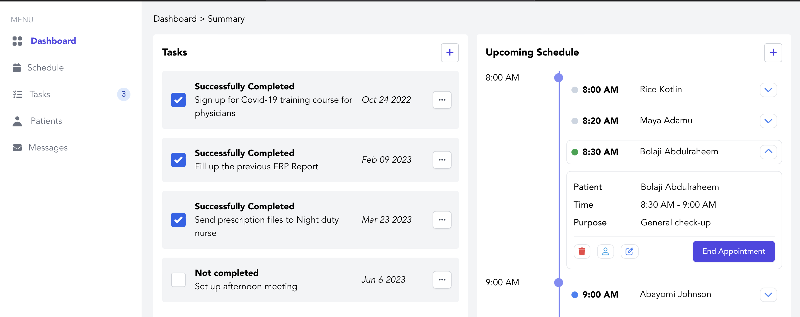
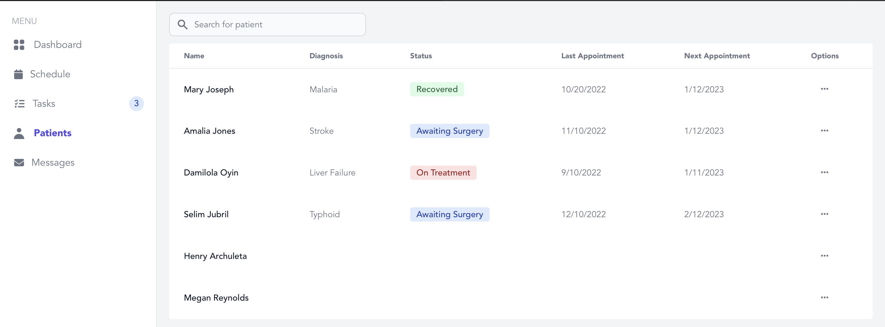

# Medicare

Medicare is an all-in-one tool used by medical providers to organize and streamline clincical tasks, schedules, patient records, and patient communication.
[Click here to see the live site](http://52.14.184.81).

## Table of contents

- [Overview](#overview)
  - [Features](#features)
  - [Screenshots](#screenshots)
- [My process](#my-process)
  - [Tools used](#tools-used)

## Overview

### Features

- A streamlined dashboard that allows for providers to managed clinical tasks, appointments, and schedule.
- Integrated messaging service allowing for fast, easy patient-provider communcation.

### Screenshots

## My process

### Tools used

- React
- Tailwind CSS
- Node
- Express
- MongoDB
- AWS
